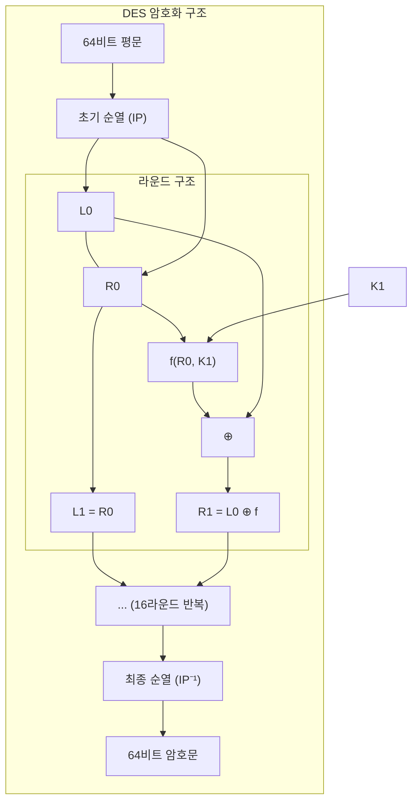
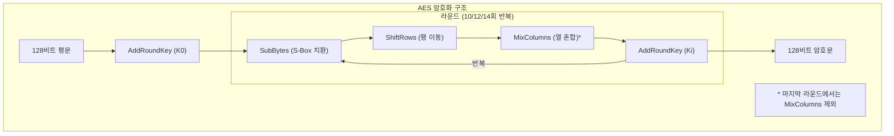
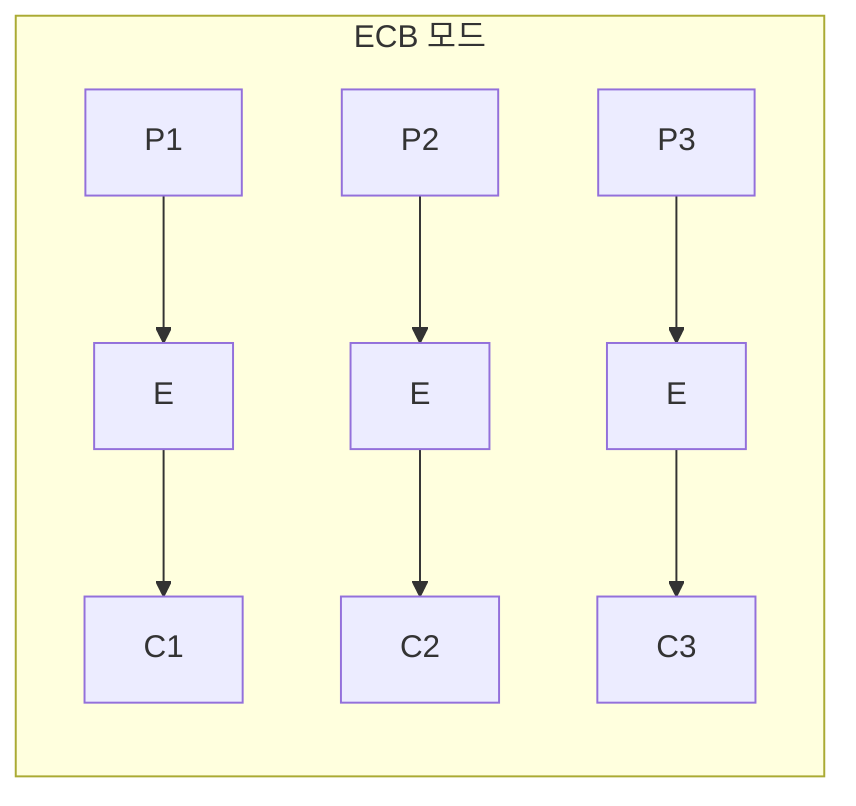
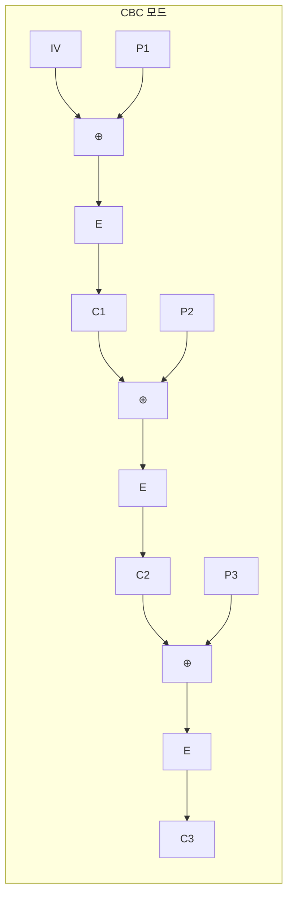
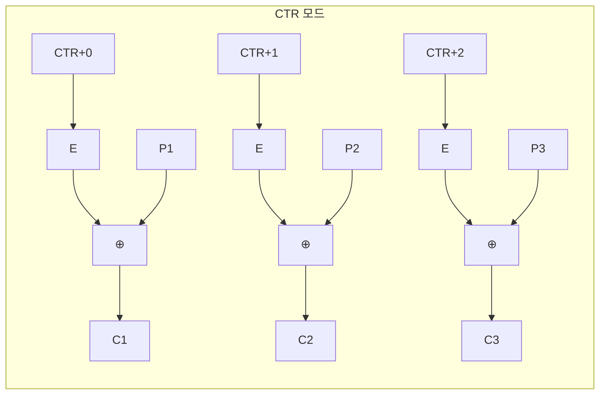
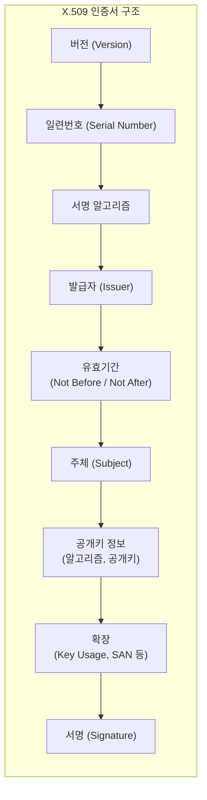
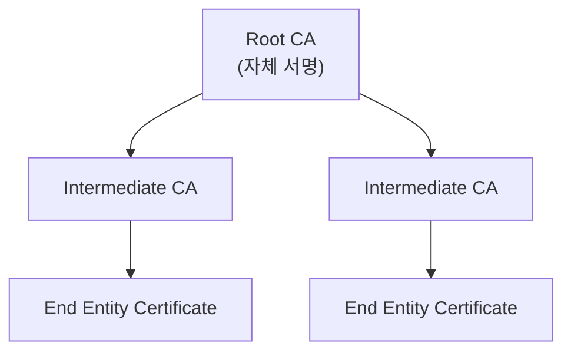
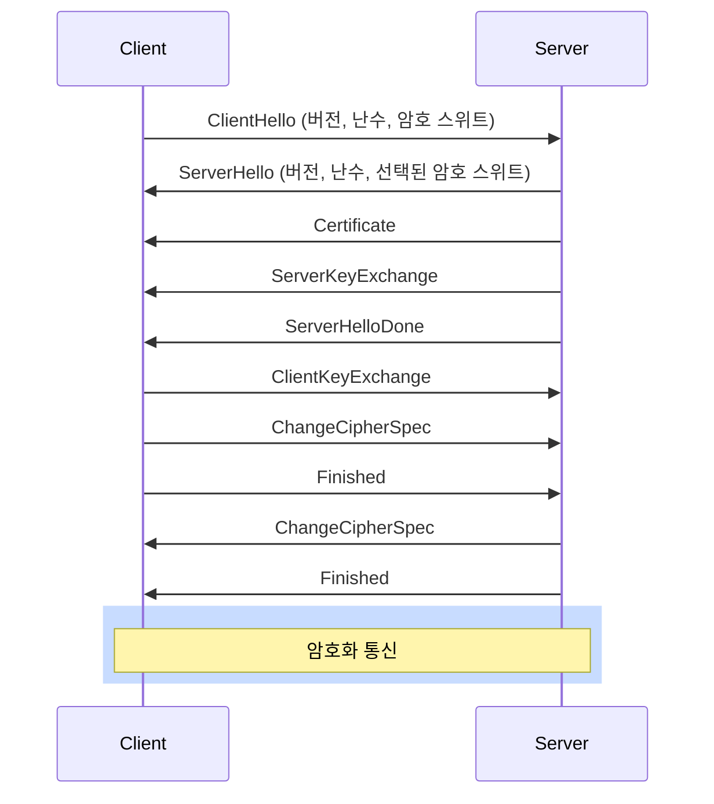

# 암호학 (Cryptography)

## 1. 암호학 기초

### 1.1 암호학 개요

암호학(Cryptography)은 정보를 보호하기 위한 수학적 기법을 연구하는 학문이다.

| 용어 | 설명 |
|------|------|
| 평문 (Plaintext) | 암호화되지 않은 원본 메시지 |
| 암호문 (Ciphertext) | 암호화된 메시지 |
| 암호화 (Encryption) | 평문을 암호문으로 변환 |
| 복호화 (Decryption) | 암호문을 평문으로 변환 |
| 키 (Key) | 암호화/복호화에 사용되는 비밀 정보 |

### 1.2 암호학의 목표

| 목표 | 설명 | 예시 |
|------|------|------|
| 기밀성 (Confidentiality) | 인가된 사용자만 정보 열람 | 암호화 |
| 무결성 (Integrity) | 정보의 위변조 방지 | 해시, MAC |
| 인증 (Authentication) | 신원 확인 | 전자서명, 인증서 |
| 부인방지 (Non-repudiation) | 행위 사실 부인 방지 | 전자서명 |

### 1.3 Kerckhoffs의 원칙

> "암호 시스템의 안전성은 키의 비밀성에만 의존해야 하며, 알고리즘의 비밀성에 의존해서는 안 된다."

- 알고리즘은 공개되어도 안전해야 함
- 키만 비밀로 유지하면 보안 유지 가능
- 현대 암호학의 기본 원칙

---

## 2. 대칭키 암호 (Symmetric Key Cryptography)

### 2.1 개요

동일한 키로 암호화와 복호화를 수행하는 방식이다.

**특징:**
- 암호화/복호화 속도가 빠름
- 키 분배 문제 (Key Distribution Problem)
- n명의 사용자: n(n-1)/2 개의 키 필요

### 2.2 블록 암호 (Block Cipher)

고정된 크기의 블록 단위로 암호화한다.

#### 주요 알고리즘

| 알고리즘 | 블록 크기 | 키 길이 | 특징 |
|----------|-----------|---------|------|
| DES | 64비트 | 56비트 | 페이스텔 구조, 현재 취약 |
| 3DES | 64비트 | 112/168비트 | DES 3회 적용 |
| AES | 128비트 | 128/192/256비트 | SPN 구조, 현재 표준 |
| SEED | 128비트 | 128비트 | 한국 표준, 페이스텔 구조 |
| ARIA | 128비트 | 128/192/256비트 | 한국 표준, SPN 구조 |
| LEA | 128비트 | 128/192/256비트 | 경량 암호, IoT용 |

#### DES (Data Encryption Standard)



**페이스텔(Feistel) 구조:**
- 라운드 함수가 역함수를 가질 필요 없음
- 암호화와 복호화 구조 동일
- 라운드 키 순서만 반대

#### AES (Advanced Encryption Standard)



**SPN (Substitution-Permutation Network) 구조:**
- 치환(Substitution)과 순열(Permutation) 조합
- 복호화 시 역연산 필요

### 2.3 블록 암호 운용 모드

| 모드 | 설명 | 장점 | 단점 |
|------|------|------|------|
| ECB | 각 블록 독립 암호화 | 단순, 병렬처리 가능 | 패턴 노출, 비권장 |
| CBC | 이전 암호문 블록과 XOR | 패턴 숨김 | 순차처리, IV 필요 |
| CFB | 스트림 암호처럼 동작 | 블록보다 작은 단위 처리 | 오류 전파 |
| OFB | 키 스트림 생성 | 오류 전파 없음 | 동일 IV 재사용 위험 |
| CTR | 카운터 값 암호화 | 병렬처리, 랜덤 접근 | 카운터 재사용 위험 |
| GCM | CTR + 인증 태그 | 기밀성 + 무결성 | 구현 복잡 |







### 2.4 스트림 암호 (Stream Cipher)

비트 또는 바이트 단위로 암호화한다.

| 알고리즘 | 특징 |
|----------|------|
| RC4 | 간단, 빠름, TLS/WEP에서 사용(취약) |
| ChaCha20 | 현대적, 모바일 최적화, TLS 1.3 |
| A5/1, A5/2 | GSM 암호화(취약) |

**RC4 취약점:**
- 초기 바이트 편향
- WEP 프로토콜 취약점
- TLS에서 더 이상 사용 금지

---

## 3. 비대칭키 암호 (Asymmetric Key Cryptography)

### 3.1 개요

공개키와 개인키 쌍을 사용하는 방식이다.

| 구분 | 공개키 | 개인키 |
|------|--------|--------|
| 공개 여부 | 공개 | 비밀 |
| 암호화 | 기밀성 제공 | - |
| 서명 | - | 서명 생성 |
| 검증 | 서명 검증 | - |

**특징:**
- 키 분배 문제 해결
- 대칭키 대비 느림 (1000배 이상)
- 주로 키 교환, 전자서명에 사용

### 3.2 RSA

가장 널리 사용되는 공개키 암호 알고리즘이다.

**수학적 기반:** 큰 수의 소인수분해 어려움

```
키 생성:
1. 두 큰 소수 p, q 선택
2. n = p × q 계산
3. φ(n) = (p-1)(q-1) 계산
4. gcd(e, φ(n)) = 1인 e 선택 (보통 65537)
5. d ≡ e⁻¹ (mod φ(n)) 계산

공개키: (n, e)
개인키: (n, d)

암호화: C = M^e mod n
복호화: M = C^d mod n
```

**RSA 권장 키 길이:**
- 현재: 2048비트 이상
- 장기 보안: 3072비트 이상
- 최고 보안: 4096비트

### 3.3 ElGamal

**수학적 기반:** 이산 대수 문제 (DLP)

```
키 생성:
1. 큰 소수 p와 생성자 g 선택
2. 비밀키 x (1 < x < p-1) 선택
3. y = g^x mod p 계산

공개키: (p, g, y)
개인키: x

암호화:
1. 랜덤 k 선택
2. C1 = g^k mod p
3. C2 = M × y^k mod p

복호화:
M = C2 × (C1^x)^(-1) mod p
```

### 3.4 타원곡선 암호 (ECC)

타원곡선 위의 이산 대수 문제를 기반으로 한다.

**장점:**
- 짧은 키 길이로 동등한 보안 강도
- 적은 연산량, 빠른 속도
- 모바일/IoT 환경에 적합

**키 길이 비교:**

| 보안 강도 | 대칭키 | RSA | ECC |
|-----------|--------|-----|-----|
| 80비트 | 80 | 1024 | 160 |
| 112비트 | 112 | 2048 | 224 |
| 128비트 | 128 | 3072 | 256 |
| 256비트 | 256 | 15360 | 512 |

**주요 곡선:**
- NIST P-256, P-384, P-521
- Curve25519 (현대적, 안전)
- secp256k1 (비트코인)

### 3.5 키 교환 프로토콜

#### Diffie-Hellman (DH)

```
1. 공개 파라미터: 소수 p, 생성자 g
2. Alice: 비밀키 a 선택, A = g^a mod p 전송
3. Bob: 비밀키 b 선택, B = g^b mod p 전송
4. 공유 비밀: K = B^a = A^b = g^ab mod p
```

**취약점:** 중간자 공격 (MITM)에 취약 → 인증 필요

#### ECDH (Elliptic Curve Diffie-Hellman)

DH의 타원곡선 버전으로, 더 짧은 키로 동등한 보안을 제공한다.

---

## 4. 해시 함수 (Hash Function)

### 4.1 개요

임의 길이의 입력을 고정 길이의 출력으로 변환하는 일방향 함수이다.

**특성:**
| 특성 | 설명 |
|------|------|
| 역상 저항성 | H(x) = h에서 x를 찾기 어려움 |
| 제2역상 저항성 | x가 주어질 때 H(x) = H(x')인 x'를 찾기 어려움 |
| 충돌 저항성 | H(x) = H(y)인 x, y 쌍을 찾기 어려움 |

### 4.2 주요 해시 알고리즘

| 알고리즘 | 출력 길이 | 상태 |
|----------|-----------|------|
| MD5 | 128비트 | 취약 (충돌 발견) |
| SHA-1 | 160비트 | 취약 (충돌 발견) |
| SHA-256 | 256비트 | 안전, 널리 사용 |
| SHA-384 | 384비트 | 안전 |
| SHA-512 | 512비트 | 안전 |
| SHA-3 | 224/256/384/512비트 | 최신 표준 |

### 4.3 해시 함수 응용

| 응용 | 설명 |
|------|------|
| 무결성 검증 | 파일/메시지 변조 탐지 |
| 비밀번호 저장 | 해시값만 저장 (단방향) |
| 전자서명 | 메시지 다이제스트 생성 |
| 블록체인 | 블록 연결, 작업증명 |

### 4.4 비밀번호 해싱

**안전한 방식:**
1. 솔트(Salt) 추가
2. 느린 해시 함수 사용
3. 키 스트레칭

| 알고리즘 | 특징 |
|----------|------|
| bcrypt | 솔트 내장, 조절 가능한 비용 |
| scrypt | 메모리 집약적, GPU 공격 저항 |
| Argon2 | 최신 표준, 메모리/시간/병렬성 조절 |
| PBKDF2 | 반복 횟수 조절 가능 |

```
일반 해시: H(password) → 레인보우 테이블 공격 가능

솔트 해시: H(password + salt) → 각 사용자별 다른 해시

키 스트레칭: H(H(H(...H(password + salt)...))) → 무차별 대입 어려움
```

---

## 5. 메시지 인증 코드 (MAC)

### 5.1 개요

비밀키를 사용하여 메시지의 무결성과 인증을 제공한다.

```
송신자: MAC = MAC_K(M), (M, MAC) 전송
수신자: MAC' = MAC_K(M), MAC == MAC' 검증
```

### 5.2 종류

| 종류 | 구조 | 예시 |
|------|------|------|
| HMAC | 해시 기반 | HMAC-SHA256 |
| CMAC | 블록 암호 기반 | AES-CMAC |
| GMAC | GCM 모드 기반 | AES-GMAC |

### 5.3 HMAC 구조

```
HMAC(K, M) = H((K' ⊕ opad) || H((K' ⊕ ipad) || M))

K': 키를 블록 크기로 패딩
opad: 0x5c 반복
ipad: 0x36 반복
```

---

## 6. 전자서명 (Digital Signature)

### 6.1 개요

개인키로 서명하고 공개키로 검증하는 방식이다.

**제공 기능:**
- 인증 (Authentication)
- 무결성 (Integrity)
- 부인방지 (Non-repudiation)

### 6.2 서명 과정

```
서명 생성:
1. 메시지 해시: h = H(M)
2. 개인키로 서명: S = Sign(h, 개인키)
3. (M, S) 전송

서명 검증:
1. 메시지 해시: h' = H(M)
2. 공개키로 검증: Verify(S, h', 공개키)
3. h == h' 확인
```

### 6.3 주요 알고리즘

| 알고리즘 | 기반 | 특징 |
|----------|------|------|
| RSA 서명 | 소인수분해 | 가장 널리 사용 |
| DSA | 이산 대수 | 서명 전용 |
| ECDSA | 타원곡선 | 짧은 서명, 빠름 |
| EdDSA | 타원곡선 (Ed25519) | 현대적, 안전 |

### 6.4 DSA vs RSA

| 구분 | RSA | DSA |
|------|-----|-----|
| 용도 | 암호화 + 서명 | 서명 전용 |
| 서명 크기 | 키 크기와 동일 | 키보다 작음 |
| 검증 속도 | 빠름 | 느림 |
| 생성 속도 | 느림 | 빠름 |

---

## 7. 공개키 기반구조 (PKI)

### 7.1 개요

공개키 암호의 신뢰성을 보장하는 인프라이다.

### 7.2 구성 요소

| 구성 요소 | 역할 |
|-----------|------|
| CA (인증기관) | 인증서 발급, 폐지 |
| RA (등록기관) | 사용자 등록, 신원 확인 |
| Repository | 인증서, CRL 저장소 |
| CRL/OCSP | 인증서 폐지 목록/상태 확인 |

### 7.3 X.509 인증서



### 7.4 인증서 체인



### 7.5 인증서 폐지

| 방식 | 설명 | 장단점 |
|------|------|--------|
| CRL | 폐지 목록 주기적 배포 | 실시간성 부족, 목록 커짐 |
| OCSP | 실시간 상태 조회 | 실시간, 서버 부하 |
| OCSP Stapling | 서버가 OCSP 응답 첨부 | 성능 개선 |

---

## 8. 암호 프로토콜

### 8.1 SSL/TLS

#### TLS 핸드셰이크 (TLS 1.2)



#### TLS 1.3 개선사항

- 1-RTT 핸드셰이크 (0-RTT 지원)
- 취약 알고리즘 제거 (RSA 키 교환, CBC 모드 등)
- 핸드셰이크 암호화
- PFS (Perfect Forward Secrecy) 필수

### 8.2 IPsec

| 프로토콜 | 기능 |
|----------|------|
| AH | 인증, 무결성 (암호화 없음) |
| ESP | 기밀성, 인증, 무결성 |
| IKE | 키 교환, SA 협상 |

**운영 모드:**
- 전송 모드: IP 페이로드만 보호
- 터널 모드: 전체 IP 패킷 보호

### 8.3 무선 보안 프로토콜

| 프로토콜 | 암호화 | 인증 | 상태 |
|----------|--------|------|------|
| WEP | RC4 | 공유키 | 취약 |
| WPA | TKIP (RC4) | PSK/802.1X | 취약 |
| WPA2 | AES-CCMP | PSK/802.1X | 안전 |
| WPA3 | AES-GCMP | SAE/802.1X | 최신 |

---

## 9. 암호 분석 (Cryptanalysis)

### 9.1 공격 유형

| 공격 유형 | 공격자 접근 | 설명 |
|-----------|-------------|------|
| 암호문 단독 공격 | 암호문만 | 가장 어려운 조건 |
| 기지 평문 공격 | 평문-암호문 쌍 | 일부 쌍을 알고 있음 |
| 선택 평문 공격 | 평문 선택 가능 | 임의 평문 암호화 가능 |
| 선택 암호문 공격 | 암호문 선택 가능 | 임의 암호문 복호화 가능 |

### 9.2 현대 공격 기법

| 공격 | 대상 | 설명 |
|------|------|------|
| 차분 분석 | 블록 암호 | 입력 차이와 출력 차이 분석 |
| 선형 분석 | 블록 암호 | 선형 근사식 활용 |
| 부채널 공격 | 구현 | 타이밍, 전력, 전자파 분석 |
| 생일 공격 | 해시 | 충돌 찾기 (2^(n/2) 복잡도) |

### 9.3 양자 컴퓨팅 위협

| 알고리즘 | 영향 |
|----------|------|
| Shor 알고리즘 | RSA, ECC 등 무력화 |
| Grover 알고리즘 | 대칭키/해시 보안 강도 절반 |

**대응:**
- 포스트 양자 암호 (PQC) 표준화 진행 중
- NIST PQC 선정: CRYSTALS-Kyber, CRYSTALS-Dilithium, SPHINCS+

---

## 시험 대비 핵심 포인트

### 암호 알고리즘 비교

| 구분 | 대칭키 | 비대칭키 |
|------|--------|----------|
| 키 개수 | 1개 (공유) | 2개 (공개/개인) |
| 속도 | 빠름 | 느림 |
| 키 분배 | 어려움 | 쉬움 |
| 용도 | 대용량 데이터 암호화 | 키 교환, 서명 |
| 예시 | AES, SEED, ARIA | RSA, ECC |

### 주요 수치

| 항목 | 권장 값 |
|------|---------|
| 대칭키 | 128비트 이상 |
| RSA 키 | 2048비트 이상 |
| ECC 키 | 256비트 이상 |
| 해시 | SHA-256 이상 |

### 취약 알고리즘

- **사용 금지:** DES, RC4, MD5, SHA-1, WEP, WPA(TKIP)
- **주의:** 3DES (점진적 폐지), RSA-1024

---

## 용어 해설

| 용어 | 설명 |
|------|------|
| 평문/암호문 (Plaintext/Ciphertext) | 암호화 전 원본 메시지 / 암호화 후 변환된 메시지 |
| Kerckhoffs의 원칙 | 암호 시스템의 안전성은 알고리즘이 아닌 키의 비밀성에만 의존해야 한다는 원칙 |
| 대칭키 암호 (Symmetric Key) | 암호화와 복호화에 동일한 키를 사용하는 방식. AES, SEED 등 |
| 비대칭키 암호 (Asymmetric Key) | 공개키와 개인키 쌍을 사용하는 방식. RSA, ECC 등 |
| 블록 암호 (Block Cipher) | 고정 크기 블록 단위로 암호화하는 방식. AES(128비트), DES(64비트) |
| 스트림 암호 (Stream Cipher) | 비트 또는 바이트 단위로 암호화하는 방식. RC4, ChaCha20 |
| 페이스텔 구조 (Feistel) | DES, SEED 등에서 사용. 암호화와 복호화 구조가 동일 |
| SPN (Substitution-Permutation Network) | AES, ARIA에서 사용. 치환과 순열을 반복 |
| IV (Initialization Vector) | 블록 암호 운용 모드에서 첫 블록 암호화에 사용되는 초기값 |
| ECB (Electronic Codebook) | 각 블록을 독립적으로 암호화. 패턴 노출 취약, 사용 비권장 |
| CBC (Cipher Block Chaining) | 이전 암호문과 XOR 후 암호화. 가장 널리 사용되는 모드 |
| CTR (Counter) | 카운터 값을 암호화하여 키 스트림 생성. 병렬 처리 가능 |
| GCM (Galois/Counter Mode) | CTR + 인증 태그. 기밀성과 무결성 동시 제공 |
| RSA | 소인수분해 문제 기반 공개키 암호. 암호화와 서명 모두 가능 |
| ECC (Elliptic Curve Cryptography) | 타원곡선 기반 공개키 암호. RSA보다 짧은 키로 동등한 보안 |
| DH (Diffie-Hellman) | 이산대수 문제 기반 키 교환 프로토콜. MITM에 취약하여 인증 필요 |
| 해시 함수 (Hash Function) | 임의 길이 입력을 고정 길이 출력으로 변환하는 일방향 함수 |
| 역상 저항성 (Preimage Resistance) | 해시값에서 원본을 찾기 어려운 특성 |
| 충돌 저항성 (Collision Resistance) | 같은 해시값을 가지는 두 입력을 찾기 어려운 특성 |
| 솔트 (Salt) | 비밀번호 해싱 시 추가되는 랜덤 값. 레인보우 테이블 공격 방지 |
| 키 스트레칭 (Key Stretching) | 해시를 여러 번 반복하여 무차별 대입 공격을 어렵게 하는 기법 |
| MAC (Message Authentication Code) | 비밀키를 사용한 메시지 인증 코드. HMAC, CMAC 등 |
| HMAC (Hash-based MAC) | 해시 함수 기반 MAC. HMAC-SHA256이 가장 많이 사용됨 |
| 전자서명 (Digital Signature) | 개인키로 서명하고 공개키로 검증. 인증, 무결성, 부인방지 제공 |
| DSA (Digital Signature Algorithm) | 이산대수 기반 서명 전용 알고리즘 |
| ECDSA | 타원곡선 기반 전자서명 알고리즘. 비트코인, TLS에서 사용 |
| PKI (Public Key Infrastructure) | 공개키의 신뢰성을 보장하는 인프라. CA, 인증서, CRL 등 |
| CA (Certificate Authority) | 인증서를 발급하고 관리하는 인증 기관 |
| CRL (Certificate Revocation List) | 폐지된 인증서 목록. 주기적으로 배포 |
| OCSP | 인증서 폐지 상태를 실시간 조회하는 프로토콜 |
| X.509 | 공개키 인증서의 표준 형식 |
| TLS (Transport Layer Security) | 전송 계층 보안 프로토콜. HTTPS에서 사용 |
| PFS (Perfect Forward Secrecy) | 장기 비밀키가 노출되어도 과거 세션 키는 안전한 특성 |
| 부채널 공격 (Side-Channel Attack) | 전력 소비, 타이밍, 전자파 등을 분석하여 암호를 해독하는 공격 |
| 양자 컴퓨팅 | Shor 알고리즘으로 RSA/ECC 무력화 가능. 포스트 양자 암호 필요 |
| PQC (Post-Quantum Cryptography) | 양자 컴퓨터에도 안전한 암호 알고리즘. CRYSTALS-Kyber 등
