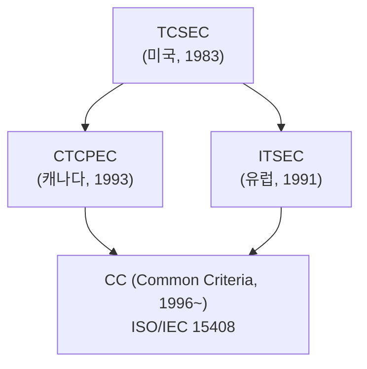
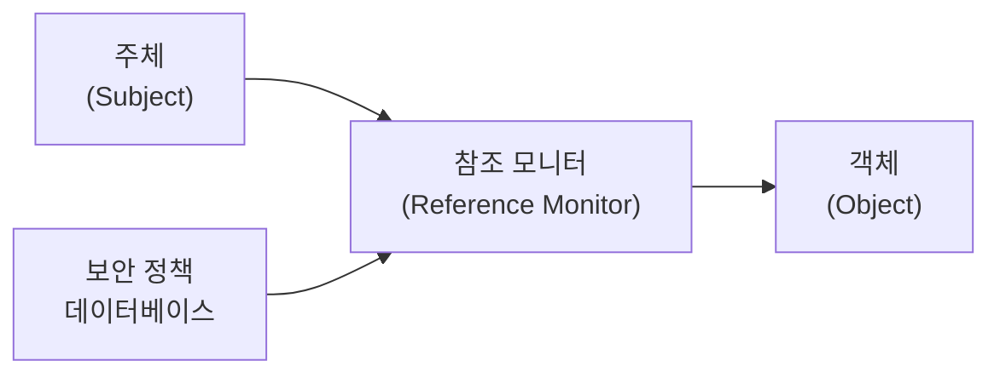
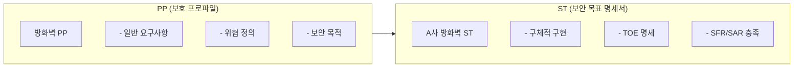
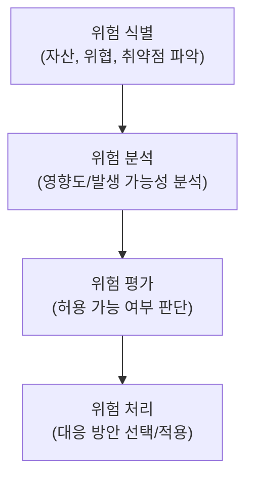
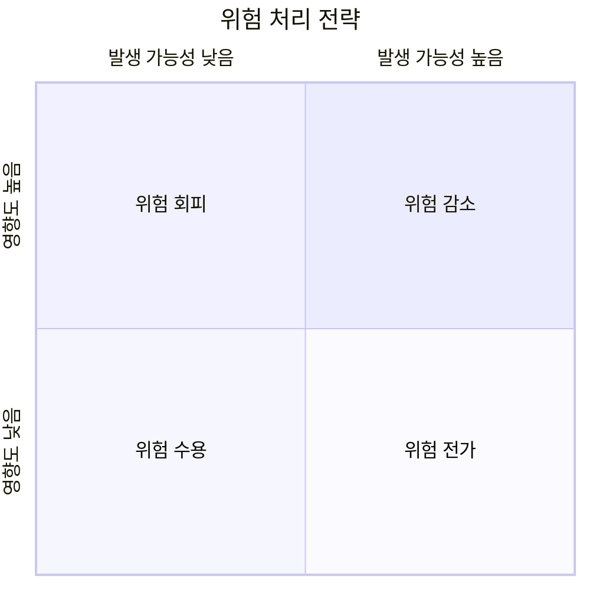
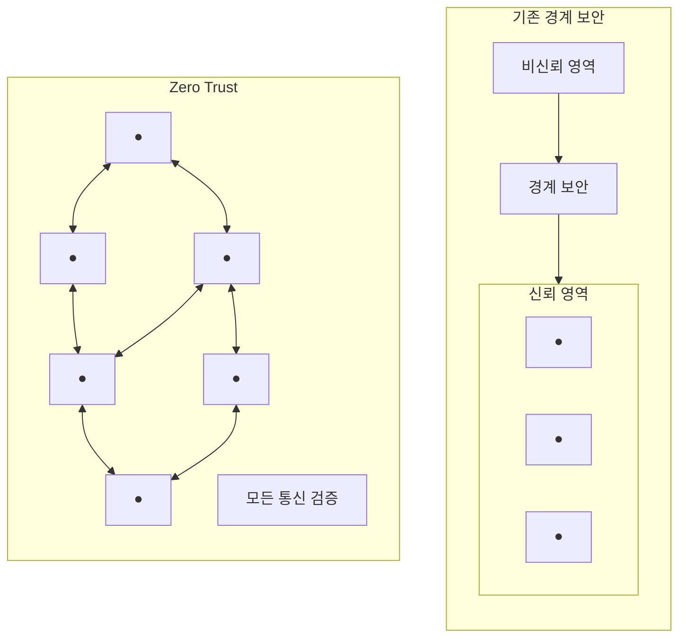

# 보안 평가 및 인증

## 1. 보안 평가 개요

### 1.1 보안 평가의 목적

보안 평가는 시스템이나 제품의 보안 수준을 객관적으로 측정하고 인증하기 위한 체계이다.

| 목적 | 설명 |
|------|------|
| 신뢰성 확보 | 제3자 평가로 객관성 확보 |
| 상호 인정 | 국가 간 평가 결과 상호 인정 |
| 품질 보증 | 보안 요구사항 충족 여부 검증 |
| 위험 관리 | 잠재적 보안 취약점 식별 |

### 1.2 보안 평가 체계 발전



---

## 2. TCSEC (Trusted Computer System Evaluation Criteria)

### 2.1 개요

미국 국방부(DoD)에서 개발한 최초의 컴퓨터 보안 평가 기준이다.

- **별칭:** 오렌지북 (Orange Book)
- **발표:** 1983년
- **특징:** 기밀성 중심, MAC 시스템 평가

### 2.2 등급 체계

| 등급 | 명칭 | 설명 |
|------|------|------|
| **D** | Minimal Protection | 보안 요건 미충족 |
| **C1** | Discretionary Security Protection | 기본 DAC |
| **C2** | Controlled Access Protection | 개선된 DAC, 감사 |
| **B1** | Labeled Security Protection | MAC 도입 |
| **B2** | Structured Protection | 형식화된 보안 정책 |
| **B3** | Security Domains | 참조 모니터 개념 |
| **A1** | Verified Design | 형식적 검증 |

```
보안 등급:
D < C1 < C2 < B1 < B2 < B3 < A1
     낮음 ←──────────────→ 높음
```

### 2.3 참조 모니터 (Reference Monitor)

모든 접근을 중재하는 추상적인 보안 메커니즘이다.

**요구사항:**
- 완전성 (Complete): 모든 접근 중재
- 격리성 (Isolated): 변조 불가
- 검증 가능성 (Verifiable): 분석/테스트 가능



---

## 3. ITSEC (Information Technology Security Evaluation Criteria)

### 3.1 개요

유럽 공동체에서 개발한 보안 평가 기준이다.

- **발표:** 1991년
- **특징:** 기밀성, 무결성, 가용성 모두 평가

### 3.2 등급 체계

| 구분 | 등급 | 설명 |
|------|------|------|
| **기능성** | F1~F10 | 보안 기능 수준 |
| **보증** | E0~E6 | 신뢰도 수준 |

**TCSEC과의 대응:**

| TCSEC | ITSEC |
|-------|-------|
| D | E0 |
| C1 | F-C1, E1 |
| C2 | F-C2, E2 |
| B1 | F-B1, E3 |
| B2 | F-B2, E4 |
| B3 | F-B3, E5 |
| A1 | F-B3, E6 |

---

## 4. Common Criteria (CC)

### 4.1 개요

국제 표준 보안 평가 기준 (ISO/IEC 15408)이다.

- **목적:** 국가 간 상호 인정
- **구성:** Part 1 (소개), Part 2 (기능), Part 3 (보증)

### 4.2 주요 개념

| 용어 | 설명 |
|------|------|
| TOE | Target of Evaluation, 평가 대상 |
| ST | Security Target, 보안 목표 명세서 |
| PP | Protection Profile, 보호 프로파일 |
| SFR | Security Functional Requirements, 보안 기능 요구사항 |
| SAR | Security Assurance Requirements, 보안 보증 요구사항 |
| EAL | Evaluation Assurance Level, 평가 보증 등급 |

### 4.3 EAL (Evaluation Assurance Level)

| 등급 | 명칭 | 설명 |
|------|------|------|
| **EAL1** | 기능 시험 | 기본적 보안 기능 동작 확인 |
| **EAL2** | 구조 시험 | 개발자 시험 결과 검토 |
| **EAL3** | 체계적 시험 | 개발 환경 통제, 구성 관리 |
| **EAL4** | 체계적 설계/시험 | 상업용 제품 최고 수준 |
| **EAL5** | 준형식적 설계/시험 | 엄격한 개발 환경 |
| **EAL6** | 준형식적 검증 설계/시험 | 높은 위험 환경 |
| **EAL7** | 형식적 검증 설계/시험 | 최고 보안 요구 환경 |

```
EAL1 < EAL2 < EAL3 < EAL4 < EAL5 < EAL6 < EAL7
 낮음 ←────────────────────────────────→ 높음

일반적 상업 제품: EAL2~EAL4
국방/정부 시스템: EAL5 이상
```

### 4.4 보호 프로파일 (PP) vs 보안 목표 명세서 (ST)

| 구분 | PP | ST |
|------|----|----|
| 작성자 | 수요자/그룹 | 개발자 |
| 대상 | 제품군 | 특정 제품 |
| TOE 특정 | 아니오 | 예 |
| 목적 | 요구사항 정의 | 평가 근거 |



### 4.5 SFR (Security Functional Requirements) 클래스

| 클래스 | 약어 | 설명 |
|--------|------|------|
| 감사 | FAU | 보안 감사 |
| 통신 | FCO | 부인 방지 |
| 암호 지원 | FCS | 암호 운영/관리 |
| 사용자 데이터 보호 | FDP | 데이터 접근통제 |
| 식별 및 인증 | FIA | 사용자 인증 |
| 보안 관리 | FMT | 보안 속성 관리 |
| 프라이버시 | FPR | 익명성, 가명성 |
| TOE 보호 | FPT | 자체 보호 |
| 자원 활용 | FRU | 가용성, 자원 할당 |
| TOE 접근 | FTA | 세션 관리 |
| 신뢰경로/채널 | FTP | 안전한 통신 |

### 4.6 상호 인정 협정 (CCRA)

Common Criteria Recognition Arrangement

- **인정 등급:** EAL1~EAL2 (cPP 기반)
- **참여국:** 한국, 미국, 일본, 영국 등 30여 개국
- **목적:** 평가 결과 상호 인정, 중복 평가 방지

---

## 5. 국내 보안 인증 체계

### 5.1 CC 인증 (IT 보안 인증)

**인증기관:** 한국인터넷진흥원 (KISA)

**대상 제품:**
- 네트워크 보안: 방화벽, IDS/IPS, VPN
- 시스템 보안: 운영체제, DBMS
- 응용 보안: 암호 모듈, 전자서명

### 5.2 KCMVP (암호 모듈 검증)

Korea Cryptographic Module Validation Program

| 항목 | 설명 |
|------|------|
| 목적 | 암호 모듈 안전성/구현 적합성 검증 |
| 근거 | 전자정부법 |
| 대상 | 국가/공공기관 정보통신망 암호 모듈 |
| 등급 | 암호 모듈 보안 등급 1~4 |

### 5.3 정보보호제품 성능평가

| 평가 대상 | 평가 항목 |
|-----------|-----------|
| 방화벽 | 처리 성능, 동시 세션 |
| IPS | 탐지율, 오탐률, 처리량 |
| VPN | 암호화 처리 성능 |

---

## 6. 정보보호 관리체계 인증

### 6.1 ISMS-P (정보보호 및 개인정보보호 관리체계 인증)

**통합 인증:**
- ISMS (정보보호 관리체계)
- PIMS (개인정보보호 관리체계)

**인증 기준:**

| 영역 | 항목 수 |
|------|---------|
| 관리체계 수립 및 운영 | 16개 |
| 보호대책 요구사항 | 64개 |
| 개인정보 처리단계별 요구사항 | 22개 |
| **합계** | **102개** |

**의무 인증 대상:**
- 정보통신서비스 매출 100억 이상
- 정보통신서비스 일일 이용자 100만 이상
- 상급종합병원, 학교 등

### 6.2 ISO/IEC 27001

국제 정보보안 경영시스템 표준이다.

**구조 (Annex A 통제 항목):**

| 영역 | 통제 수 |
|------|---------|
| 정보보안 정책 | 2 |
| 정보보안 조직 | 7 |
| 인적 자원 보안 | 6 |
| 자산 관리 | 10 |
| 접근 통제 | 14 |
| 암호화 | 2 |
| 물리적/환경적 보안 | 15 |
| 운영 보안 | 14 |
| 통신 보안 | 7 |
| 시스템 획득/개발/유지보수 | 13 |
| 공급자 관계 | 5 |
| 정보보안 사고 관리 | 7 |
| 업무 연속성 관리 | 4 |
| 준거성 | 8 |
| **합계** | **114개** |

### 6.3 ISO 27000 패밀리

| 표준 | 내용 |
|------|------|
| ISO 27000 | 개요 및 용어 |
| ISO 27001 | 요구사항 (인증 표준) |
| ISO 27002 | 통제 실무 지침 |
| ISO 27003 | 구현 지침 |
| ISO 27004 | 측정 |
| ISO 27005 | 위험 관리 |
| ISO 27017 | 클라우드 보안 통제 |
| ISO 27018 | 클라우드 개인정보 보호 |

---

## 7. 위험 관리 (Risk Management)

### 7.1 위험 관리 개요

```
위험 = 위협 × 취약점 × 자산 가치
Risk = Threat × Vulnerability × Asset Value
```

### 7.2 위험 관리 프로세스



### 7.3 위험 분석 방법론

| 구분 | 방법 | 특징 |
|------|------|------|
| **정성적** | 전문가 판단, 델파이 | 주관적, 빠름 |
| **정량적** | ALE, 시나리오 | 객관적, 비용/시간 많음 |
| **복합적** | 정성 + 정량 | 실무적 접근 |

**정량적 분석 공식:**

```
SLE = AV × EF
ALE = SLE × ARO

SLE: Single Loss Expectancy (단일 손실 예상액)
AV: Asset Value (자산 가치)
EF: Exposure Factor (노출 계수, 0~1)
ARO: Annual Rate of Occurrence (연간 발생률)
ALE: Annual Loss Expectancy (연간 손실 예상액)
```

### 7.4 위험 처리 전략

| 전략 | 설명 | 예시 |
|------|------|------|
| 위험 수용 | 위험을 받아들임 | 비용 대비 효과 낮을 때 |
| 위험 회피 | 위험 활동 중단 | 사업 철수 |
| 위험 전가 | 제3자에게 이전 | 보험, 외주 |
| 위험 감소 | 통제 수단 적용 | 보안 솔루션 도입 |



---

## 8. 보안 감사 (Security Audit)

### 8.1 감사 유형

| 유형 | 설명 |
|------|------|
| 내부 감사 | 조직 내부에서 수행 |
| 외부 감사 | 독립된 제3자가 수행 |
| 규제 감사 | 규제 기관 요구 |
| 포렌식 감사 | 침해 사고 후 조사 |

### 8.2 감사 증거

| 증거 유형 | 신뢰성 | 예시 |
|-----------|--------|------|
| 물리적 증거 | 높음 | 직접 관찰 |
| 문서적 증거 | 중간 | 정책, 절차서 |
| 분석적 증거 | 중간 | 데이터 분석 결과 |
| 증언 | 낮음 | 면담 결과 |

### 8.3 감사 기준 및 프레임워크

| 프레임워크 | 용도 |
|------------|------|
| COBIT | IT 거버넌스 |
| COSO | 내부 통제 |
| ISO 27001 | 정보보안 관리 |
| NIST CSF | 사이버 보안 |
| PCI DSS | 신용카드 데이터 보안 |

---

## 9. 보안 아키텍처

### 9.1 보안 아키텍처 모델

#### Zachman Framework

| 관점 | 질문 |
|------|------|
| 범위 | 무엇이 중요한가? |
| 기업 모델 | 어떻게 연결되는가? |
| 시스템 모델 | 어떻게 동작하는가? |
| 기술 모델 | 어떻게 구현하는가? |
| 상세 표현 | 구체적 구현 |
| 실제 시스템 | 운영 시스템 |

#### SABSA (Sherwood Applied Business Security Architecture)

| 계층 | 내용 |
|------|------|
| Contextual | 비즈니스 요구사항 |
| Conceptual | 개념 아키텍처 |
| Logical | 논리 아키텍처 |
| Physical | 물리 아키텍처 |
| Component | 컴포넌트 설계 |
| Operational | 운영 아키텍처 |

### 9.2 Zero Trust Architecture

**원칙:** "Never Trust, Always Verify"

**핵심 요소:**
- 모든 접근에 대한 지속적 검증
- 최소 권한 원칙
- 마이크로 세그멘테이션
- 암호화 통신



---

## 시험 대비 핵심 포인트

### 평가 기준 비교

| 구분 | TCSEC | ITSEC | CC |
|------|-------|-------|-----|
| 개발 | 미국 | 유럽 | 국제 |
| 중점 | 기밀성 | C.I.A | C.I.A |
| 등급 | D~A1 | E0~E6 | EAL1~7 |
| 표준 | - | - | ISO 15408 |

### CC 핵심 용어

| 약어 | 의미 |
|------|------|
| TOE | 평가 대상 (Target of Evaluation) |
| PP | 보호 프로파일 (Protection Profile) |
| ST | 보안 목표 명세서 (Security Target) |
| EAL | 평가 보증 등급 (Evaluation Assurance Level) |
| SFR | 보안 기능 요구사항 |
| SAR | 보안 보증 요구사항 |

### EAL 등급 기억법

```
EAL1: 기능 시험 (Functionally Tested)
EAL2: 구조 시험 (Structurally Tested)
EAL3: 체계적 시험 (Methodically Tested)
EAL4: 체계적 설계 (Methodically Designed)
EAL5: 준형식적 설계 (Semiformally Designed)
EAL6: 준형식적 검증 설계 (Semiformally Verified)
EAL7: 형식적 검증 설계 (Formally Verified)
```

### 위험 관리 공식

```
위험 = 위협 × 취약점 × 자산가치

ALE = SLE × ARO
    = (AV × EF) × ARO
```

### 위험 처리 전략

| 영향↑ + 가능성↑ | → 회피 또는 감소 |
| 영향↑ + 가능성↓ | → 전가 |
| 영향↓ + 가능성↑ | → 감소 또는 전가 |
| 영향↓ + 가능성↓ | → 수용 |

---

## 용어 해설

| 용어 | 설명 |
|------|------|
| TCSEC | Trusted Computer System Evaluation Criteria. 미국 국방부 보안 평가 기준 (오렌지북) |
| ITSEC | Information Technology Security Evaluation Criteria. 유럽의 보안 평가 기준 |
| CC (Common Criteria) | 국제 표준 보안 평가 기준 (ISO/IEC 15408) |
| 참조 모니터 (Reference Monitor) | 모든 접근을 중재하는 추상적 보안 메커니즘. 완전성, 격리성, 검증 가능성 필요 |
| TOE (Target of Evaluation) | CC에서 평가 대상이 되는 제품 또는 시스템 |
| PP (Protection Profile) | 특정 제품군에 대한 보안 요구사항을 정의한 문서 |
| ST (Security Target) | 특정 제품의 보안 목표를 명세한 문서. 평가의 근거 |
| EAL (Evaluation Assurance Level) | CC의 평가 보증 등급. EAL1(가장 낮음)~EAL7(가장 높음) |
| SFR (Security Functional Requirements) | CC에서 정의하는 보안 기능 요구사항 |
| SAR (Security Assurance Requirements) | CC에서 정의하는 보안 보증 요구사항 |
| CCRA | Common Criteria Recognition Arrangement. 평가 결과 상호 인정 협정 |
| KCMVP | 한국 암호 모듈 검증 프로그램. 국가/공공기관용 암호 모듈 검증 |
| ISMS-P | 정보보호 및 개인정보보호 관리체계 인증. ISMS와 PIMS 통합 |
| ISO 27001 | 정보보안 경영시스템(ISMS) 국제 표준. 114개 통제 항목 |
| ISO 27002 | ISO 27001의 통제 항목에 대한 실무 지침 |
| 위험 (Risk) | 위협이 취약점을 이용하여 자산에 손실을 야기할 가능성 |
| 위협 (Threat) | 자산에 손실을 야기할 수 있는 잠재적 원인 |
| 취약점 (Vulnerability) | 위협에 의해 이용될 수 있는 자산의 약점 |
| ALE (Annual Loss Expectancy) | 연간 손실 예상액. SLE × ARO로 계산 |
| SLE (Single Loss Expectancy) | 단일 손실 예상액. 자산가치 × 노출계수로 계산 |
| ARO (Annual Rate of Occurrence) | 위협의 연간 발생률 |
| 위험 수용 | 위험을 인지하고 받아들이는 전략. 비용 대비 효과가 낮을 때 |
| 위험 회피 | 위험 활동을 중단하여 위험을 제거하는 전략 |
| 위험 전가 | 보험, 외주 등으로 위험을 제3자에게 이전하는 전략 |
| 위험 감소 | 통제 수단을 적용하여 위험을 낮추는 전략 |
| COBIT | Control Objectives for Information and Related Technologies. IT 거버넌스 프레임워크 |
| COSO | Committee of Sponsoring Organizations. 내부 통제 프레임워크 |
| NIST CSF | NIST Cybersecurity Framework. 사이버보안 프레임워크 |
| PCI DSS | Payment Card Industry Data Security Standard. 신용카드 데이터 보안 표준 |
| Zachman Framework | 엔터프라이즈 아키텍처 프레임워크. 6x6 매트릭스 구조 |
| SABSA | Sherwood Applied Business Security Architecture. 비즈니스 중심 보안 아키텍처 |
| Zero Trust | "Never Trust, Always Verify" 원칙. 모든 접근에 대한 지속적 검증 |
| 마이크로 세그멘테이션 | 네트워크를 세분화하여 횡적 이동을 방지하는 기법
