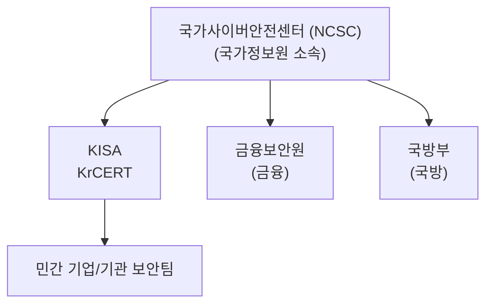
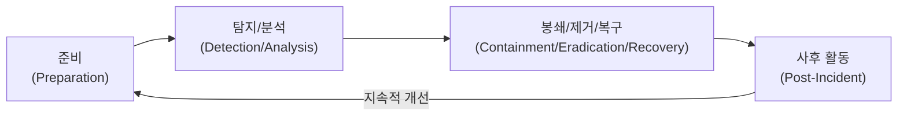

# 침해사고 대응

## 1. 침해사고 개요

### 1.1 침해사고 정의

정보통신망 또는 정보시스템에 대한 비인가된 접근, 사용, 변경, 파괴 등으로 인해 정보의 기밀성, 무결성, 가용성에 피해를 주는 사건이다.

### 1.2 침해사고 유형

| 유형 | 설명 | 예시 |
|------|------|------|
| 악성코드 감염 | 악성 소프트웨어에 의한 시스템 침해 | 랜섬웨어, 트로이목마, 웜 |
| 해킹 | 비인가 접근 및 시스템 조작 | 웹 해킹, 권한 상승 |
| 서비스 거부 | 서비스 가용성 침해 | DDoS, SYN Flooding |
| 정보 유출 | 비인가 정보 탈취 | 개인정보 유출, 영업비밀 탈취 |
| 피싱/스캠 | 사회공학적 공격 | 피싱 메일, 스미싱 |

### 1.3 침해사고 대응 목표

| 목표 | 설명 |
|------|------|
| 피해 최소화 | 신속한 대응으로 피해 확산 방지 |
| 정상 복구 | 시스템 및 서비스 정상화 |
| 증거 보존 | 법적 조치를 위한 증거 확보 |
| 재발 방지 | 취약점 보완 및 개선 |

---

## 2. 침해사고 대응 체계

### 2.1 CERT/CSIRT

**CERT (Computer Emergency Response Team)**
**CSIRT (Computer Security Incident Response Team)**

컴퓨터 보안 사고에 대응하는 전문 조직이다.

### 2.2 국내 침해사고 대응 체계



### 2.3 KISA 인터넷침해대응센터

| 기능 | 내용 |
|------|------|
| 침해사고 접수/분석 | 신고 접수 및 분석 |
| 취약점 정보 제공 | 보안 취약점 정보 배포 |
| 악성코드 분석 | 악성코드 샘플 분석 |
| 사이버 위협 경보 | 위협 수준 발령 |
| 보호나라 운영 | 보안 정보 포털 |

### 2.4 사이버 위기 경보

| 단계 | 상황 | 대응 |
|------|------|------|
| 정상 | 일상적 상황 | 일상 모니터링 |
| 관심 (Blue) | 위협 징후 탐지 | 모니터링 강화 |
| 주의 (Yellow) | 일부 피해 발생 | 대응팀 가동 |
| 경계 (Orange) | 다수 피해 확산 | 비상 대응 체제 |
| 심각 (Red) | 전국적 피해 | 범정부 대응 |

---

## 3. 침해사고 대응 절차

### 3.1 사고 대응 생명주기 (NIST)



### 3.2 단계별 활동

#### 1단계: 준비 (Preparation)

| 활동 | 내용 |
|------|------|
| 대응팀 구성 | 역할/책임 정의 |
| 대응 절차 수립 | 사고 유형별 대응 매뉴얼 |
| 도구 준비 | 포렌식 도구, 분석 도구 |
| 교육/훈련 | 모의 훈련 |
| 연락망 구축 | 내/외부 연락망 |

#### 2단계: 탐지 및 분석 (Detection & Analysis)

| 활동 | 내용 |
|------|------|
| 사고 탐지 | 모니터링, 신고 접수 |
| 초기 분석 | 사고 유형, 영향 범위 파악 |
| 우선순위 결정 | 심각도에 따른 대응 우선순위 |
| 증거 수집 | 로그, 시스템 상태 수집 |
| 관련자 통지 | 이해관계자 통보 |

**탐지 소스:**
- IDS/IPS 알림
- 안티바이러스 경고
- 로그 분석
- 사용자 신고
- 외부 기관 통보

#### 3단계: 봉쇄, 제거, 복구 (Containment, Eradication, Recovery)

**봉쇄 (Containment):**

| 전략 | 설명 |
|------|------|
| 단기 봉쇄 | 즉각적 피해 확산 방지 (네트워크 격리) |
| 장기 봉쇄 | 임시 조치로 시스템 운영 유지 |
| 시스템 격리 | 감염 시스템 네트워크 분리 |

**제거 (Eradication):**

| 활동 | 내용 |
|------|------|
| 악성코드 제거 | 감염 파일 삭제, 백신 검사 |
| 취약점 패치 | 침입 경로 차단 |
| 계정 정리 | 비인가 계정 삭제, 비밀번호 변경 |
| 시스템 재설치 | 필요 시 클린 설치 |

**복구 (Recovery):**

| 활동 | 내용 |
|------|------|
| 시스템 복원 | 백업으로부터 복원 |
| 서비스 재개 | 단계적 서비스 재개 |
| 모니터링 강화 | 재감염 모니터링 |
| 정상화 확인 | 시스템 정상 동작 확인 |

#### 4단계: 사후 활동 (Post-Incident Activity)

| 활동 | 내용 |
|------|------|
| 사후 분석 | 근본 원인 분석 |
| 보고서 작성 | 사고 경위, 대응, 교훈 문서화 |
| 개선 사항 도출 | 재발 방지 대책 수립 |
| 정책 개선 | 보안 정책/절차 개선 |

---

## 4. 디지털 포렌식

### 4.1 개요

디지털 기기에서 전자적 증거를 수집, 분석, 보존하는 과학적 절차이다.

### 4.2 포렌식 원칙

| 원칙 | 설명 |
|------|------|
| 정당성 | 적법한 절차로 수집 |
| 무결성 | 증거 변조 방지 |
| 재현성 | 동일 결과 도출 가능 |
| 신속성 | 휘발성 증거 우선 수집 |
| 연계 보관성 | 증거 보관 연속성 유지 (Chain of Custody) |

### 4.3 포렌식 절차


### 4.4 증거 수집

#### 휘발성 증거 (Volatile)

수집 우선순위 (Order of Volatility):

1. 레지스터/캐시
2. 메모리 (RAM)
3. 네트워크 상태/연결
4. 실행 중인 프로세스
5. 디스크
6. 원격 로그
7. 물리적 구성


#### 비휘발성 증거 (Non-volatile)

| 증거 유형 | 예시 |
|-----------|------|
| 저장 장치 | 하드디스크, SSD, USB |
| 로그 파일 | 시스템 로그, 웹 로그 |
| 설정 파일 | 레지스트리, 설정 |
| 문서/파일 | 문서, 이미지, 이메일 |

### 4.5 디스크 이미징

| 방식 | 설명 |
|------|------|
| 물리 이미징 | 디스크 전체 비트 단위 복제 |
| 논리 이미징 | 파일 시스템 수준 복제 |
| 해시 검증 | 원본과 사본 해시값 비교 (MD5, SHA) |

### 4.6 포렌식 도구

| 도구 | 용도 |
|------|------|
| EnCase | 상용 포렌식 분석 도구 |
| FTK | 상용 포렌식 분석 도구 |
| Autopsy | 오픈소스 포렌식 도구 |
| Volatility | 메모리 분석 도구 |
| Wireshark | 네트워크 패킷 분석 |
| dd/dcfldd | 디스크 이미징 |

---

## 5. 악성코드 분석

### 5.1 악성코드 유형

| 유형 | 특징 |
|------|------|
| 바이러스 | 다른 프로그램에 기생, 자가 복제 |
| 웜 | 독립 실행, 네트워크 전파 |
| 트로이목마 | 정상 프로그램 위장, 백도어 |
| 랜섬웨어 | 파일 암호화, 금전 요구 |
| 스파이웨어 | 정보 수집, 유출 |
| 루트킷 | 자신 은닉, 시스템 장악 |
| 봇넷 | C&C 서버 통제, DDoS 수행 |

### 5.2 분석 방법

| 분석 유형 | 설명 | 도구 |
|-----------|------|------|
| 정적 분석 | 코드 분석 (실행 없이) | IDA Pro, Ghidra |
| 동적 분석 | 실행하며 행위 분석 | 샌드박스, Process Monitor |
| 코드 분석 | 소스코드/어셈블리 분석 | 디버거, 디컴파일러 |

### 5.3 분석 환경

**샌드박스:**
- 격리된 가상 환경에서 악성코드 실행
- 시스템 변경, 네트워크 활동 모니터링
- 예: Cuckoo Sandbox, Any.Run

---

## 6. 로그 분석

### 6.1 로그 유형

| 시스템 | 로그 유형 | 위치 |
|--------|-----------|------|
| Windows | 이벤트 로그 | Event Viewer |
| Linux | Syslog | /var/log |
| 웹 서버 | 접근/에러 로그 | access.log, error.log |
| 방화벽 | 접근 로그 | 장비별 상이 |
| IDS/IPS | 탐지 로그 | 장비별 상이 |

### 6.2 Windows 이벤트 로그

| 로그 | 내용 | 이벤트 ID 예시 |
|------|------|----------------|
| Security | 인증, 접근 이벤트 | 4624 (로그온), 4625 (실패) |
| System | 시스템 이벤트 | 7045 (서비스 설치) |
| Application | 애플리케이션 이벤트 | - |
| PowerShell | PS 스크립트 실행 | 4103, 4104 |

### 6.3 Linux 로그

| 로그 파일 | 내용 |
|-----------|------|
| /var/log/auth.log | 인증 로그 |
| /var/log/syslog | 시스템 로그 |
| /var/log/secure | 보안 관련 로그 |
| /var/log/messages | 일반 메시지 |
| ~/.bash_history | 명령어 기록 |

### 6.4 웹 서버 로그

**Apache 접근 로그:**
```
192.168.1.100 - - [01/Jan/2025:12:00:00 +0900] "GET /index.html HTTP/1.1" 200 1234 "-" "Mozilla/5.0"
```

| 필드 | 의미 |
|------|------|
| IP 주소 | 클라이언트 IP |
| 타임스탬프 | 접근 시간 |
| 요청 | HTTP 메서드, URI |
| 상태 코드 | HTTP 응답 코드 |
| 크기 | 응답 크기 |
| User-Agent | 브라우저 정보 |

---

## 7. 침해 지표 (IoC)

### 7.1 IoC (Indicators of Compromise)

침해사고의 흔적이나 증거가 되는 기술적 지표이다.

| IoC 유형 | 예시 |
|----------|------|
| 파일 해시 | 악성코드 파일의 MD5, SHA256 |
| IP 주소 | C&C 서버, 공격자 IP |
| 도메인 | 악성 도메인, 피싱 사이트 |
| URL | 악성코드 다운로드 URL |
| 이메일 주소 | 피싱 발송 주소 |
| 레지스트리 키 | 악성코드 지속성 유지 키 |
| 파일 경로 | 악성 파일 설치 경로 |

### 7.2 MITRE ATT&CK

공격자 전술, 기법, 절차(TTP)를 체계화한 지식베이스이다.

**전술 (Tactics):**

| 전술 | 설명 |
|------|------|
| Initial Access | 최초 침투 |
| Execution | 악성코드 실행 |
| Persistence | 지속성 유지 |
| Privilege Escalation | 권한 상승 |
| Defense Evasion | 탐지 회피 |
| Credential Access | 자격증명 탈취 |
| Discovery | 정보 수집 |
| Lateral Movement | 내부 이동 |
| Collection | 데이터 수집 |
| Command and Control | C&C 통신 |
| Exfiltration | 데이터 유출 |
| Impact | 최종 목표 달성 |

### 7.3 STIX/TAXII

**STIX (Structured Threat Information eXpression):**
위협 정보를 표현하는 표준 포맷

**TAXII (Trusted Automated eXchange of Indicator Information):**
위협 정보를 교환하는 표준 프로토콜

---

## 8. 침해사고 신고

### 8.1 신고 의무

| 대상 | 신고 기관 | 기한 |
|------|-----------|------|
| 정보통신서비스 제공자 | KISA | 24시간 이내 |
| 주요정보통신기반시설 | 관계 중앙행정기관 | 지체 없이 |
| 개인정보 유출 | 개인정보보호위원회 | 72시간 이내 |
| 금융회사 | 금융감독원 | 즉시 |

### 8.2 개인정보 유출 통지

**통지 대상:**
- 정보주체 (피해자)
- 개인정보보호위원회 또는 KISA

**통지 내용:**
1. 유출된 개인정보 항목
2. 유출 시점과 경위
3. 피해 최소화 방법
4. 대응 조치 및 피해 구제 절차
5. 담당부서 및 연락처

---

## 9. 재해 복구

### 9.1 복구 전략

| 전략 | 설명 | RTO |
|------|------|-----|
| 미러링 | 실시간 데이터 복제 | 즉시 |
| Hot Standby | 대기 시스템 상시 가동 | 분 |
| Warm Standby | 대기 시스템 부분 가동 | 시간 |
| Cold Standby | 백업 복원 | 일 |

### 9.2 백업 및 복구 테스트

| 테스트 유형 | 설명 |
|-------------|------|
| 백업 검증 | 백업 데이터 무결성 확인 |
| 복원 테스트 | 실제 복원 수행 확인 |
| 전환 테스트 | 대체 사이트 전환 검증 |
| 모의 훈련 | 시나리오 기반 훈련 |

---

## 10. 사이버 보험

### 10.1 보상 범위

| 범위 | 내용 |
|------|------|
| 1자 손해 | 자사의 직접적 손해 |
| 3자 손해 | 고객/거래처 피해 배상 |
| 사고 대응 비용 | 포렌식, 법률 비용 |
| 업무 중단 손실 | 서비스 중단으로 인한 매출 손실 |

---

## 용어 해설

| 용어 | 설명 |
|------|------|
| 침해사고 | 정보시스템에 대한 비인가 접근, 변경, 파괴 등으로 인한 보안 피해 사건 |
| CERT | Computer Emergency Response Team, 컴퓨터 비상 대응팀 |
| CSIRT | Computer Security Incident Response Team, 컴퓨터 보안 사고 대응팀 |
| NCSC | National Cyber Security Center, 국가사이버안전센터 (국정원 소속) |
| KISA | Korea Internet & Security Agency, 한국인터넷진흥원 |
| KrCERT | KISA 인터넷침해대응센터 |
| 보호나라 | KISA에서 운영하는 보안 정보 포털 사이트 |
| 사이버 위기 경보 | 정상-관심(Blue)-주의(Yellow)-경계(Orange)-심각(Red) 5단계 경보 체계 |
| NIST | National Institute of Standards and Technology, 미국 국립표준기술연구소 |
| 준비 (Preparation) | 사고 대응을 위한 사전 준비 단계 (팀 구성, 도구 준비, 훈련) |
| 탐지/분석 (Detection/Analysis) | 사고 탐지 및 초기 분석 단계 |
| 봉쇄 (Containment) | 피해 확산 방지를 위한 격리 조치 단계 |
| 제거 (Eradication) | 악성코드 제거 및 취약점 패치 단계 |
| 복구 (Recovery) | 시스템 복원 및 서비스 재개 단계 |
| 사후 활동 (Post-Incident) | 근본 원인 분석 및 개선 사항 도출 단계 |
| 디지털 포렌식 | 디지털 기기에서 전자적 증거를 수집, 분석, 보존하는 과학적 절차 |
| Chain of Custody | 증거 보관 연속성, 증거가 수집부터 법정 제출까지 무결성을 유지한 기록 |
| 휘발성 (Volatility) | 전원 차단 시 사라지는 데이터의 속성 (메모리 > 디스크) |
| Order of Volatility | 휘발성 정도에 따른 증거 수집 우선순위 |
| 물리 이미징 | 디스크 전체를 비트 단위로 복제하는 방식 |
| 논리 이미징 | 파일 시스템 수준에서 복제하는 방식 |
| EnCase | 상용 디지털 포렌식 분석 도구 |
| FTK | Forensic Toolkit, 상용 포렌식 분석 도구 |
| Autopsy | 오픈소스 디지털 포렌식 플랫폼 |
| Volatility | 메모리 포렌식 분석 오픈소스 도구 |
| dd/dcfldd | 디스크 이미징용 Linux 명령어 |
| 바이러스 (Virus) | 다른 프로그램에 기생하여 자가 복제하는 악성코드 |
| 웜 (Worm) | 독립 실행되며 네트워크를 통해 전파되는 악성코드 |
| 트로이목마 (Trojan) | 정상 프로그램으로 위장한 악성코드 |
| 랜섬웨어 (Ransomware) | 파일을 암호화하고 금전을 요구하는 악성코드 |
| 스파이웨어 (Spyware) | 사용자 정보를 몰래 수집하는 악성코드 |
| 루트킷 (Rootkit) | 자신을 숨기고 시스템을 장악하는 악성코드 |
| 봇넷 (Botnet) | C&C 서버 명령으로 통제되는 감염 시스템 네트워크 |
| C&C (Command and Control) | 공격자가 악성코드를 원격 제어하는 서버 |
| 정적 분석 (Static Analysis) | 악성코드를 실행하지 않고 코드를 분석하는 방법 |
| 동적 분석 (Dynamic Analysis) | 악성코드를 실행하며 행위를 분석하는 방법 |
| 샌드박스 (Sandbox) | 격리된 가상 환경에서 악성코드를 안전하게 실행/분석하는 시스템 |
| Cuckoo Sandbox | 오픈소스 자동화 악성코드 분석 샌드박스 |
| IDA Pro | 상용 역공학/디스어셈블리 분석 도구 |
| Ghidra | NSA에서 개발한 오픈소스 역공학 도구 |
| 이벤트 로그 | Windows 시스템의 활동 기록 (Security, System, Application) |
| Syslog | Linux/Unix 시스템 로그 표준 |
| IoC | Indicators of Compromise, 침해 지표 (파일 해시, IP, 도메인 등) |
| MITRE ATT&CK | 공격자 전술, 기법, 절차(TTP)를 체계화한 지식 프레임워크 |
| TTP | Tactics, Techniques, and Procedures, 공격자의 전술/기법/절차 |
| Lateral Movement | 내부 네트워크 내에서 다른 시스템으로 이동하는 공격 기법 |
| Persistence | 시스템 재부팅 후에도 악성코드가 유지되도록 하는 기법 |
| Privilege Escalation | 일반 권한에서 관리자 권한으로 상승하는 공격 기법 |
| STIX | Structured Threat Information eXpression, 위협 정보 표현 표준 포맷 |
| TAXII | Trusted Automated eXchange of Indicator Information, 위협 정보 교환 프로토콜 |
| 미러링 | 실시간 데이터 복제 방식의 재해 복구 전략 |
| Hot Standby | 상시 가동 대기 시스템 (즉시 전환 가능) |
| Warm Standby | 부분 가동 대기 시스템 (시간 내 전환 가능) |
| Cold Standby | 백업 복원 기반 복구 (일 단위 복구) |
| 사이버 보험 | 사이버 공격으로 인한 손해를 보상하는 보험 상품 |

---

## 시험 대비 핵심 포인트

### 침해사고 대응 단계

```
준비 → 탐지/분석 → 봉쇄/제거/복구 → 사후활동
```

### 포렌식 원칙

| 원칙 | 의미 |
|------|------|
| 정당성 | 적법한 절차 |
| 무결성 | 변조 방지 |
| 재현성 | 동일 결과 |
| 신속성 | 휘발성 우선 |
| 연계 보관성 | Chain of Custody |

### 증거 수집 우선순위 (휘발성)

```
레지스터 → 캐시 → 메모리 → 네트워크 → 프로세스 → 디스크
(휘발성 높음) ────────────────────────→ (휘발성 낮음)
```

### 신고 기한

| 사고 유형 | 기한 |
|-----------|------|
| 침해사고 | 24시간 |
| 개인정보 유출 | 72시간 |

### MITRE ATT&CK 주요 전술

```
Initial Access → Execution → Persistence → Privilege Escalation
→ Defense Evasion → Credential Access → Discovery
→ Lateral Movement → Collection → C&C → Exfiltration → Impact
```

### 사이버 위기 경보

| 단계 | 색상 | 상황 |
|------|------|------|
| 관심 | Blue | 위협 징후 |
| 주의 | Yellow | 일부 피해 |
| 경계 | Orange | 다수 피해 |
| 심각 | Red | 전국적 피해 |
